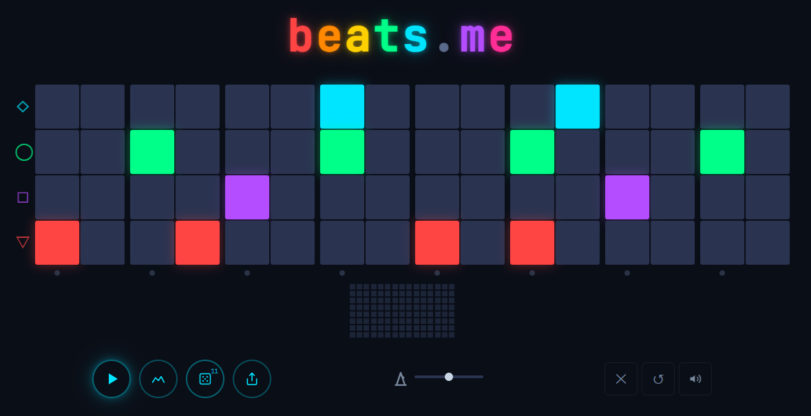

# beats.me

A browser-based step sequencer where you place tiles on a grid, a playhead sweeps across, and everything sounds good — no musical knowledge required.

Harmony is invisibly constrained by the app. You compose rhythm. The system makes you sound brilliant.

**[Try it live →](https://play.sauravplayspiano.com)**



## How it works

The board is a **4-row × 16-step grid**. Each row is a different voice; the 16 steps are 8 beats, each split into an on-beat and an "and". Press play and a playhead sweeps left to right — every tile it crosses fires that row's sound.

The trick is that you only place **rhythm**. Harmony is handled for you: the engine locks everything to a scale and a chord progression that evolves as the song plays, and it layers in bass, pads, stabs, and arpeggios automatically — so whatever you place sounds intentional. The same grid always produces the same result (it's seeded), which is what lets a shared link reproduce a track exactly.

- **Dice** re-rolls a *variation seed* (0–15) — same beat, different sonic character (arp shape, accents, voicings, key).
- **Modes** change how the song is structured: `short` (a ~40s arc with intro, build, and outro), `long` (a seed-generated arrangement), and `loop` (infinite).
- **Share** packs the whole state — grid, tempo, mutes, volumes, variation, mode — into a 16-byte URL hash, so a link rebuilds the exact track.

## Stack

- **UI:** React + TypeScript + Tailwind CSS
- **Audio:** Tone.js (scheduling, synthesis, effects)
- **Build:** Vite — outputs a static site you can host anywhere

## Getting started

**Prerequisites:** Node `^20.19.0 || >=22.12.0` (Vite 8 requirement).

```bash
npm install
npm run dev        # start the dev server (http://localhost:5173)
```

Other commands:

```bash
npm run build      # type-check + production build to dist/
npm run preview    # serve the production build locally
npm test           # run the test suite (Vitest)
npm run lint       # lint with ESLint
```

## Project structure

```
src/
  engine/        Tone.js sound engine — Scheduler, Player, SoundEngine (plain TS, not React)
  presets/       musical params, voice palettes, config derivation
  arrangement/   seed-driven long-arrangement generator
  components/    React UI — grid + EQ visualizer
  lib/           share-via-URL, analytics, shared types
  App.tsx        top-level app: grid state, controls, engine wiring
```

## Design

See [DESIGN.md](DESIGN.md) for the full visual design system — colors, typography, motion, cell states.

Open `design-preview.html` in a browser for a rendered preview.

## Architecture

See [docs/designs/sound-engine.md](docs/designs/sound-engine.md) for the engine architecture (Scheduler / Player / SoundEngine) and [docs/designs/synthwave-preset.md](docs/designs/synthwave-preset.md) for the sound design and arrangement system.

Key decisions:
- **Thin Seam:** Clean boundary between grid (React) and sound engine (Tone.js module)
- **Cells are triggers, not gates:** Sound engine controls sustain/decay
- **Seeded PRNG:** Same grid = same sound (deterministic emergent behavior)
- **Share via URL:** 16-byte grid state encoded as base64url in URL hash

## Analytics (optional)

beats.me reports anonymous usage via [PostHog](https://posthog.com) and errors via
[Sentry](https://sentry.io), but it works fully without them. Both are off unless you
provide keys, and they only activate in a production build — `npm run dev` never sends data.

To wire up your own:

```bash
cp .env.example .env.local
# then edit .env.local and fill in either/both keys
```

- `VITE_POSTHOG_KEY` — PostHog project API key (starts with `phc_`)
- `VITE_SENTRY_DSN` — Sentry DSN

Leave a value blank to keep that integration off. `.env.local` is gitignored, so your
keys are never committed. They get inlined into the production bundle at build time, so
treat them as public (both are write-only by design). If you build on a remote host
(Cloudflare Pages, Netlify, etc.) rather than locally, set the same variables in that
host's environment settings.

## Contributing

This is a personal project, shared in case it's useful or interesting. Issues and pull
requests are welcome, though I may be slow to respond. If you open a PR, please run
`npm test` and `npm run lint` first.

## License

MIT — see [LICENSE](LICENSE).
